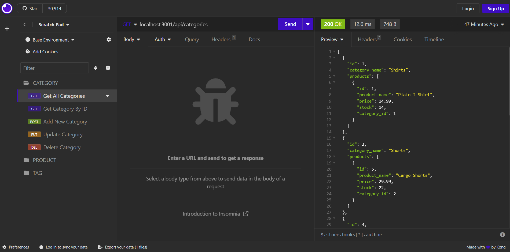

# E-Commerce Back-End

  

## Table of Contents
-[Description](#description)  
-[Installation](#installation)  
-[Usage](#usage)  
-[Contributing](#contributing)  
-[Credits](#credits)  
-[License](#license)  
-[Questions](#questions)

## Description
Internet retail is a huge business and it is important to be able to keep up with competing e-commerce companies. This application was created as a usable back-end for an internet retail website. It allows a user to easily navigate through the server's routes. There are routes set up to get, update, add, and delete products, categories, and tags. This project uses node.js, express.js, mysql2, sequelize, and dotenv.

## Installation
To install this app to your local machine you first need to create a .env file with the database name, your mysql user name, and your mysql password. This will allow the npm package dotenv to use that info in the code. Next, make sure to run an npm install by typing "npm i" into the terminal. Next, log in to the mysql shell and run the schema by typing "SOURCE db/schema.sql". Then, exit out of the mysql shell. Now your application is ready to start. If you want to add seeds to the application, type "npm run seed" into the terminal and test data will be added. To start the app, type "npm start", and the server will start running and listening for api calls.

## Usage
[Usage Video](https://drive.google.com/file/d/1Xyqtm02dbB1NnhiyRe_lpSR1ge7I28sm/view)  
  
To use this application, make sure that your terminal is located in the file that holds the app. Then run the installation commands described in the installation section of this readme. Once the server has started, open a back-end environment like Insomnia to be able to interact with the server without a front-end. The api routes are directed through six endpoints: /api/categories, /api/products, /api/tags, /api/categories/:id, /api/products/:id, and /api/tags/:id. To view all categories, products, or tags make a GET request to the endpoints /api/categories, /api/products, and /api/tags respectively. To view a specific category, product, or tag make a GET request to the endpoints /api/categories/:id, /api/products/:id,  and /api/tags/:id respectively, with ":id" replaced by an id number. To add a category, make a POST request to the endpoint /api/categories with a new "category_name" in the body formatted in JSON. To add a new product, make a POST request to the endpoint /api/products with at least a new "product_name", "price", and tagIds in the body formatted in JSON. Optional paramaters are amount of "stock" (will default to 10) and "category_id". To add a new tag, make a POST request to the endpoint /api/tags with the "tag_name" in the body formatted as JSON. To update a category, product, or tag make a POST request to the endpoints /api/categories/:id, /api/products/:id, and api/tags/:id respectively with whatever parameters need to be changed in the body, formatted as JSON with ":id" in the endpoint being an id number. To delete a category, product, or tag make a DELETE request to the endpoints /api/categories/:id, /api/products/:id, and /api/tags/:id with ":id" being the id of the category, product, or tag you want to delete. To stop the server, type "control + c" in your terminal.

## Contributing
To contribe, fork the project, create a branch to work on, edit that branch, and then create a pull request. If the edits are approved, your contributions will be added.

## Credits
This project was sourced from a Uconn web development bootcamp with some edits in the following repo: https://git.bootcampcontent.com/University-of-Connecticut/CONN-VIRT-FSF-PT-07-2023-U-LOLC.git. The routes and models were created mostly by me. There are also references to the documentation for express.js, sequelize, mysql and dotenv.

## License
This project is not protected under any license.

## Questions
To view more of my work, view my GitHub profile: [adaking1](https://github.com/adaking1)

If you have any questions about this project please email me here: kinga1215@yahoo.com

